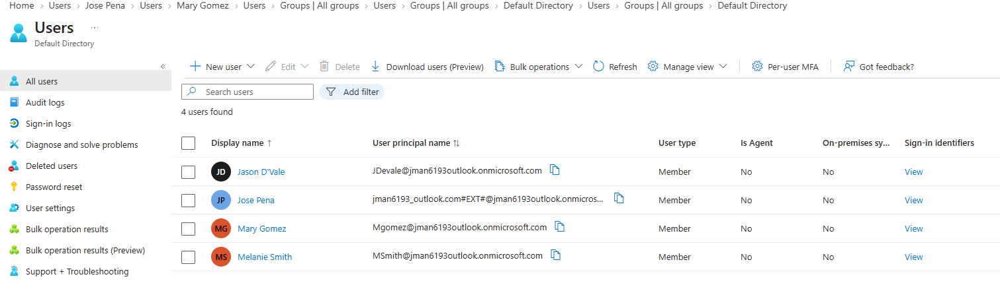
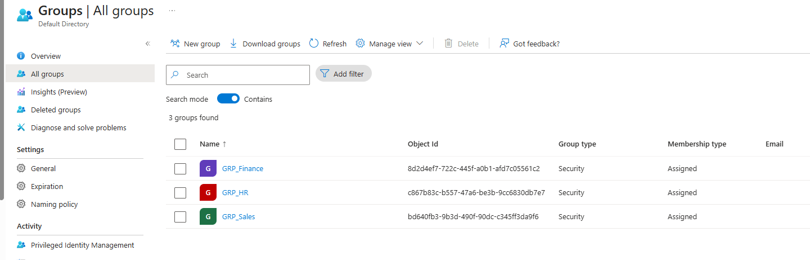
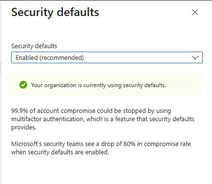
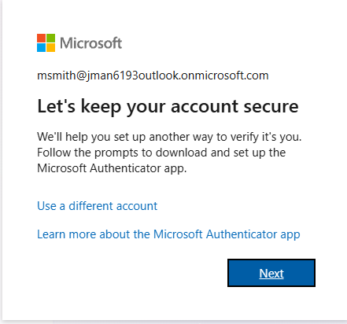
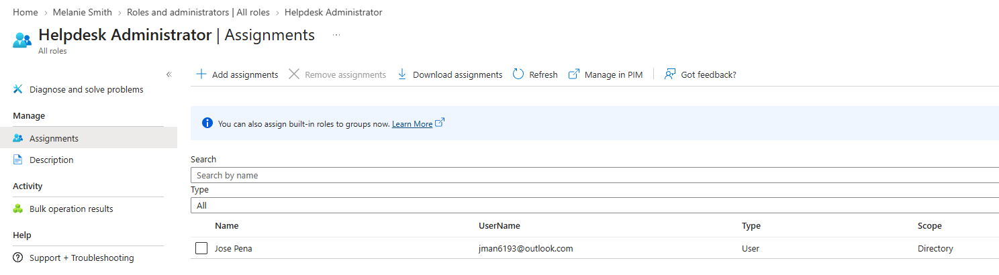

# Microsoft Entra ID (Azure AD) Identity & Access Management Lab

## 🔹 Project Overview
This project shows how to set up Identity and Access Management (IAM) using Microsoft Entra ID. To simulate a corporate network, I built a cloud-based identity structure focused on user lifecycles, Role-Based Access Control (RBAC), and the Principle of Least Privilege.

## 🛠️ Tools & Features Used
* **Platform:** Microsoft Entra ID (Azure AD)
* **Features:** User Provisioning, Security Groups (RBAC), Security Defaults (MFA), Directory Roles.

---

## ⚙️ Step-by-Step Implementation

### Step 1: Creating the Enterprise Users
I manually provisioned several test accounts to build our corporate directory.
* Went to **Users** > **All Users** > **New user**.
* Set up a standardized corporate **User Principal Name (UPN)** format for each employee.
* Filled out their profiles, making sure to assign their specific **Job Title** and **Department** (like HR, IT, Finance) so they have clear identity attributes.

### Step 2: Setting up Role-Based Access Control (RBAC)
Instead of managing permissions user-by-user, I organized them into department-level Security Groups.
* Went to **Groups** > **All Groups** > **New group**.
* Created specific groups like *IT_Department* and *HR_Department*.
* Set the membership type to **Assigned** and added the corresponding users to their proper groups so they automatically inherit the right access.

### Step 3: Hardening the Tenant with MFA
To secure the accounts against password attacks, I enabled tenant-wide authentication rules.
* Went to the main properties page and clicked **Manage Security Defaults**.
* Toggled **Security Defaults** to **Enabled** to force MFA across the entire environment.
* Tested the setup with a test account, successfully triggering the mandatory Microsoft Authenticator prompt during login.

### Step 4: Role Delegation (Principle of Least Privilege)
I practiced assigning granular administrative access so nobody has more power than they need to do their job.
* Went into **Users**, clicked my main account, and opened **Assigned roles**.
* Clicked **Add assignments** and gave myself the **Helpdesk Administrator** role.
* This allows the account to handle password resets and basic troubleshooting without giving it risky Global Admin rights over the whole tenant.
* *(Note: This lab was created using this account, so this step was for the sake of simulation. Being the tenant creator, my account naturally holds Global Administrator privileges as well).*

